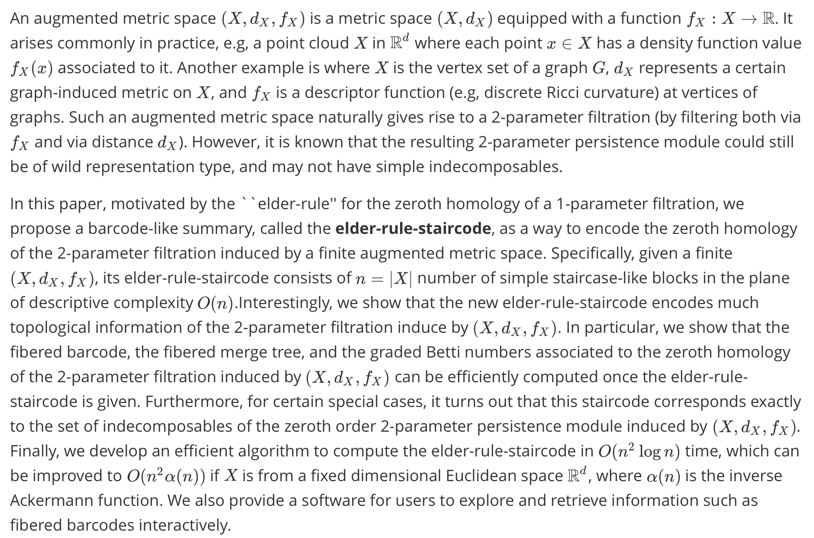

# Elder-rule-staircodes for augmented metric spaces (Submitted to SOCG 2020)

**Chen Cai, Woojin Kim, Facundo Memoli, Yusu Wang**

* To run the code

``
python ER/ER_staircode.py --full # computes ER_staircode
python ER/gui.py  # launch a simple gui for interactive visualization
``

* Submit a issue or contact me via cai.507@osu.edu