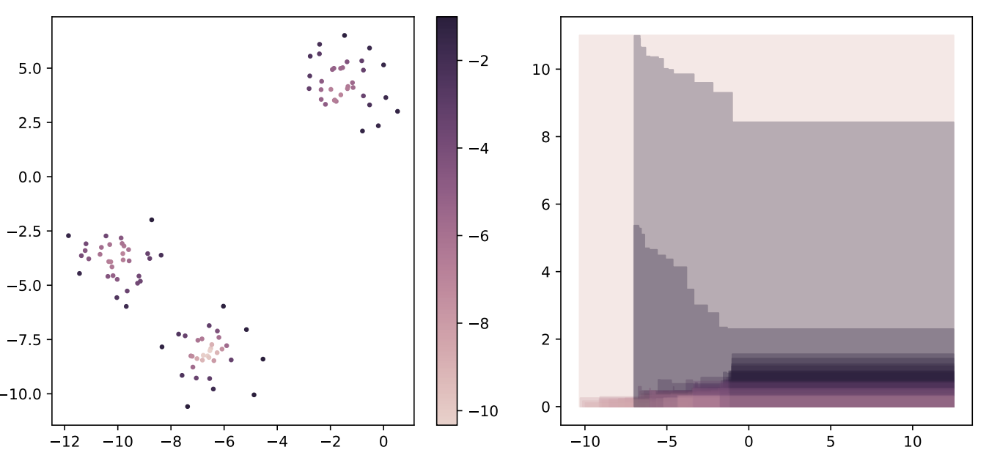

# Elder-rule-staircodes for augmented metric spaces

**Chen Cai, Woojin Kim, Facundo Memoli, Yusu Wang**



### Install
The code is tested for python=3.6.7. 
* download the code with:

``
git clone git@github.com:Chen-Cai-OSU/ER-staircode.git
``

* move to the directory:

``
cd ER-staircode
``

* Install all the requirements:

``
pip install --user --requirement requirements.txt
``
* computes ER_staircode and save it for visualization:

``
python ER/ER_staircode.py --full 
``

* launch a simple gui (graphical user interfaces) for interactive visualization:

``
python ER/gui.py  
``

### Tutorial
Also see the short tutorial (tutorial.ipynb) on how to use the software for your own data.

### Figure
run
``
python ER/fig.py
``
to generate the figure above. 

### Contact 
* If you have any questions, submit a issue on github or contact me via c1cai@ucsd.edu

### Cite
Please consider citing our paper if you are using the code.
```
@inproceedings{cai2020elder,
  title={Elder-Rule-Staircodes for Augmented Metric Spaces},
  author={Cai, Chen and Kim, Woojin and M{\'e}moli, Facundo and Wang, Yusu},
  booktitle={36th International Symposium on Computational Geometry (SoCG 2020)},
  year={2020},
  organization={Schloss Dagstuhl-Leibniz-Zentrum f{\"u}r Informatik}
}
```